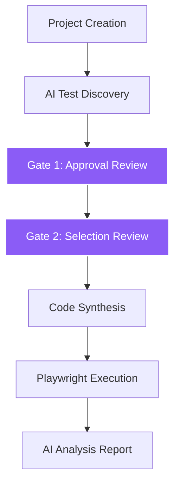

# TestMaster AI

> **AI-powered end-to-end test automation. Describe a user journey, get a Playwright test suite.**


TestMaster AI is a production-grade automation platform that leverages Large Language Models to bridge the gap between business requirements and executable test code. It automates the discovery of test cases, the synthesis of Playwright scripts, and the deep analysis of execution results, enabling QA teams to provision robust automation pipelines in seconds rather than days.

---

## 🚀 How It Works



1.  **Project Creation**: Define your target application URL and scope.
2.  **AI Test Discovery**: Gemini 3.1 analyzes the journey and proposes a structured test plan using visual context.
3.  **Gate 1 (Approval)**: Human reviewers approve the test logic for proposed cases.
4.  **Gate 2 (Selection)**: Reviewers select which of the approved cases to run in the current execution cycle.
5.  **Code Synthesis**: Validated cases are transformed into hardened Playwright TypeScript code.
6.  **Playwright Execution**: Tests run in a headless environment with automated retry and timeout logic.
7.  **AI Analysis Report**: Final execution results are summarized into an executive report with technical breakdowns and visual evidence.

---

## ⚙️ Detailed Setup Guide

### Prerequisites
*   **Node.js**: v18 or higher
*   **Python**: v3.11 or higher
*   **PostgreSQL**: v15 or higher

---

### 1. Backend Setup

#### **Windows**
1.  **Environment**:
    ```powershell
    cd backend
    python -m venv .venv
    .\.venv\Scripts\activate
    ```
2.  **Install**:
    ```powershell
    pip install -r requirements.txt
    ```
3.  **Config**:
    Copy `.env.example` to `.env`. Ensure `PLAYWRIGHT_WORKSPACE_PATH` uses absolute paths with forward slashes (e.g., `C:/Users/Name/TestMaster-AI/playwright-workspace`).

#### **Mac / Linux**
1.  **Environment**:
    ```bash
    cd backend
    python3 -m venv .venv
    source .venv/bin/activate
    ```
2.  **Install**:
    ```bash
    pip install -r requirements.txt
    ```
3.  **Config**:
    Copy `.env.example` to `.env`. Ensure `PLAYWRIGHT_WORKSPACE_PATH` is correctly set to your absolute path.

#### **Database Initialization (Cross-Platform)**
```bash
alembic upgrade head
```

#### **Run Server**
```bash
python -m uvicorn app.main:app --reload
```

---

### 2. Frontend Setup

1.  **Install Dependencies**:
    ```bash
    cd frontend
    npm install
    ```
2.  **Run Development Server**:
    ```bash
    npm run dev
    ```
3.  **Access**:
    Open `http://localhost:5173`.

---

### 3. Playwright Workspace Setup
The `playwright-workspace` directory handles the execution and storage of tests.
1.  **Install Playwright Browsers**:
    ```bash
    npx playwright install chromium
    ```
2.  **Credentials**:
    Optionally create a `.env` file in `playwright-workspace/` to store shared credentials:
    ```env
    LOGIN_USER=demo_user
    LOGIN_PASS=demo_password
    ```

---

## 🔑 Environment Variables (.env)

| Variable | Required | Description |
| :--- | :---: | :--- |
| `DATABASE_URL` | Yes | PostgreSQL connection string (must use `postgresql+asyncpg://`). |
| `GEMINI_API_KEY` | Yes | Your Google AI Studio API Key. |
| `GEMINI_MODEL` | No | Model ID (default: `gemini-3.1-flash-lite`). |
| `PLAYWRIGHT_WORKSPACE` | No | Relative path to workspace (default: `../playwright-workspace`). |
| `PLAYWRIGHT_WORKSPACE_PATH` | Yes | **Absolute path** to the `playwright-workspace` directory. |
| `PLAYWRIGHT_TIMEOUT_MS` | No | Max execution time per test (default: `120000`). |

---

## 📖 Usage Walkthrough

1.  **Generate New Test-Cases**: In the dashboard, click "Generate New Test-Cases" and provide the app URL.
2.  **Review & Approve (Gate 1)**: Review the AI's proposed test cases. Use the checkboxes to **Approve** the logic you want to keep.
3.  **Select for Execution (Gate 2)**: On the reloaded screen, select which of your **Approved** tests should run now.
4.  **Synthesis**: Click **Synthesize & Run Code**. The system will generate TypeScript code and start execution.
5.  **Report**: Review the final **AI Deep Analysis** which includes screenshots and failure summaries.

---

## 📡 API Reference

| Method | Endpoint | Description |
| :--- | :--- | :--- |
| `POST` | `/projects/` | Create a project. |
| `POST` | `/projects/{id}/sessions/` | Start discovery. |
| `POST` | `/sessions/{id}/test-cases/approve` | **Bulk approve** cases (Gate 1). |
| `PATCH` | `/sessions/{id}/test-cases/{tc_id}` | Select for execution (Gate 2). |
| `POST` | `/sessions/{id}/generate-script` | Generate Playwright code. |
| `POST` | `/scripts/{id}/execute` | Run the automation suite. |
| `GET` | `/executions/{id}/report` | Fetch the final AI report. |

---

## 🛠 Tech Stack

| Layer | Technology |
| :--- | :--- |
| **Backend** | FastAPI (Async), Python 3.11+ |
| **Frontend** | React (Vite, TypeScript, Lucide Icons) |
| **Database** | PostgreSQL + SQLAlchemy 2.0 (Async) |
| **AI Model** | Google Gemini 3.1 Flash |
| **Test Runner** | Playwright |
