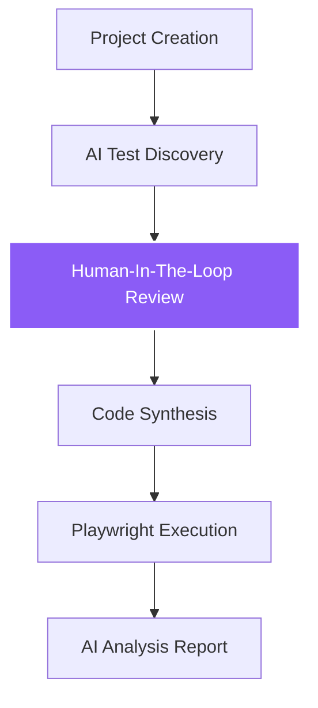

# TestMaster AI

> **AI-powered end-to-end test automation. Describe a user journey, get a Playwright test suite.**


TestMaster AI is a production-grade automation platform that leverages Large Language Models to bridge the gap between business requirements and executable test code. It automates the discovery of test cases, the synthesis of Playwright scripts, and the deep analysis of execution results, enabling QA teams to provision robust automation pipelines in seconds rather than days.

---

## 🚀 How It Works



1.  **Project Creation**: Define your target application URL and scope.
2.  **AI Test Discovery**: Gemini 3.1 analyzes the journey and proposes a structured test plan.
3.  **HITL Review**: Humans select, deselect, and inspect the internal steps of each proposed case.
4.  **Code Synthesis**: Validated cases are transformed into hardened Playwright TypeScript code.
5.  **Playwright Execution**: Tests run in a headless environment with automated retry and timeout logic.
6.  **AI Analysis Report**: Final execution results are summarized into an executive report with technical breakdowns.

---

## 🛠 Tech Stack

| Layer | Technology |
| :--- | :--- |
| **Backend** | FastAPI (Async) |
| **Frontend** | React (Vite, TypeScript, Lucide Icons) |
| **Database** | PostgreSQL |
| **ORM** | SQLAlchemy 2.0 (Async) |
| **Migrations** | Alembic |
| **AI Model** | Google Gemini 3.1 Flash Lite |
| **Test Runner** | Playwright |
| **Architecture** | Service-Repository Pattern |

---

## 📂 Project Structure

<details>
<summary>View Folder Tree</summary>

```text
TestMaster-AI/
├── backend/                # FastAPI Application root
│   ├── app/
│   │   ├── core/           # Database config & security
│   │   ├── models/         # SQLAlchemy DB models
│   │   ├── repositories/   # Data access layer
│   │   ├── routers/        # API Endpoints (Projects, Generation, Execution)
│   │   ├── schemas/        # Pydantic models
│   │   ├── services/       # Business logic (LLM, Playwright, Reports)
│   │   └── main.py         # Application entry point
│   ├── alembic/            # Database migrations
│   └── requirements.txt    # Python dependencies
├── frontend/               # React SPA (Vite)
│   ├── src/
│   │   ├── pages/          # Dashboard, Workspace, Pipeline views
│   │   └── App.tsx         # Routing & Brand initialization
│   └── package.json        # Node dependencies
├── playwright-workspace/   # External dir for generated scripts & reports
└── tests/                  # Root for Playwright test discovery
```
</details>

---

## ⚙️ Setup Guide

### 1. Backend Setup
1.  **Clone & Environment**:
    ```bash
    git clone <repo-url>
    cd backend
    python -m venv .venv
    source .venv/bin/activate  # Windows: .venv\Scripts\activate
    ```
2.  **Install Dependencies**:
    ```bash
    pip install -r requirements.txt
    ```
3.  **Environment Configuration**:
    Copy `.env.example` to `.env` and configure:
    *   `DATABASE_URL`: Your PostgreSQL connection string.
    *   `GEMINI_API_KEY`: Your Google AI Studio API key.
    *   `GEMINI_MODEL`: Gemini model name to use for discovery, script generation, and report generation. Defaults to `gemini-3.1-flash-lite`.
4.  **Migrations & Start**:
    ```bash
    alembic upgrade head
    python -m uvicorn app.main:app --reload
    ```
    > [!IMPORTANT]
    > **Windows Runtime**: `asyncio.WindowsProactorEventLoopPolicy` is automatically enforced in `main.py` for subprocess compatibility.

### 2. Frontend Setup
1.  **Install & Dev**:
    ```bash
    cd frontend
    npm install
    npm run dev
    ```
2.  **Access**:
    The application will be available at `http://localhost:5173`. It expects the backend API at `http://localhost:8000`.

---

## 🔑 Environment Variables

| Variable | Required | Description |
| :--- | :---: | :--- |
| `DATABASE_URL` | Yes | PostgreSQL connection string (Async driver required). |
| `GEMINI_API_KEY` | Yes | API Key for Google Gemini 3.1. |
| `GEMINI_MODEL` | No | Gemini model id used by the backend. Defaults to `gemini-3.1-flash-lite`. |

---

## 📖 Usage Walkthrough

1.  **Initialization**: Open the dashboard and click **Create New Testscript**.
2.  **Scoping**: Enter your Project Name and **Target Application URL**.
3.  **Discovery**: Describe the user journey. The AI will propose a suite of test cases.
4.  **HITL Review**:
    *   Use **Select All** to approve the entire plan or pick specific cases.
    *   Click **View Steps** to inspect the internal AI logic for each case.
5.  **Synthesis**: Click **Approve & Synthesize Code** to generate the Playwright suite.
6.  **Execution**: Monitor the real-time execution of your tests.
7.  **Analysis**: Review the **AI Analysis Report** for a plain-English summary of passes and failures.

---

## 📡 API Reference

<details>
<summary>View All Endpoints</summary>

| Method | Endpoint | Description |
| :--- | :--- | :--- |
| `POST` | `/projects/` | Create a new automation project. |
| `GET` | `/projects/` | List all active workspaces. |
| `POST` | `/projects/{id}/sessions/` | Start a new AI test discovery session. |
| `PATCH` | `/sessions/{id}/test-cases/{tc_id}` | Toggle test case selection. |
| `POST` | `/sessions/{id}/generate-script` | Synthesize Playwright code from selected cases. |
| `POST` | `/scripts/{id}/execute` | Run the Playwright suite (Windows-hardened). |
| `GET` | `/executions/{id}/report` | Generate/fetch the final AI analysis report. |

</details>

---

## ⚠️ Known Limitations
- **Security**: Basic authentication and RBAC are not yet implemented.
- **Scale**: Background jobs currently use `asyncio.to_thread` instead of a dedicated worker (Redis/Celery).
- **Environment**: Dockerization for production parity is in the roadmap.
- **Hygiene**: No automatic cleanup for old generated test scripts in `playwright-workspace/`.

---

## 🗺 Roadmap
- [ ] **Containerization**: Full Docker Compose stack (FastAPI, Postgres, Playwright).
- [ ] **Real-time Feedback**: WebSocket/SSE integration for live terminal output.
- [ ] **Auth**: Implementation of RBAC and JWT-based authentication.
- [ ] **Scale**: Dedicated worker pool using Redis + Celery.
- [ ] **CI/CD**: Automated pipeline for building and testing generated suites.

---
